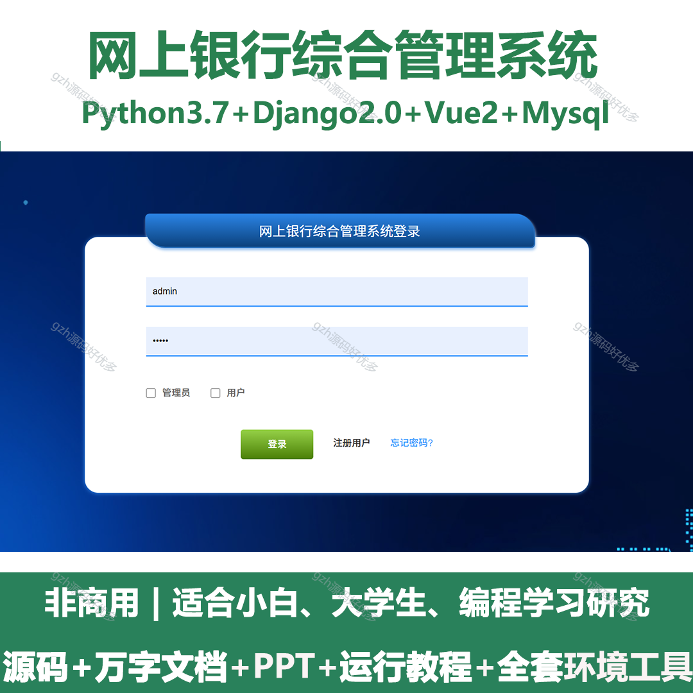
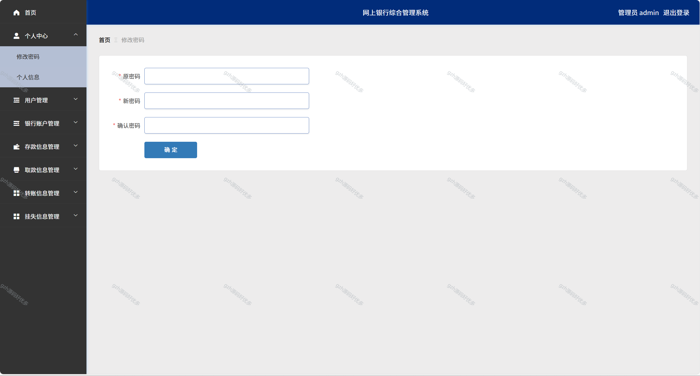
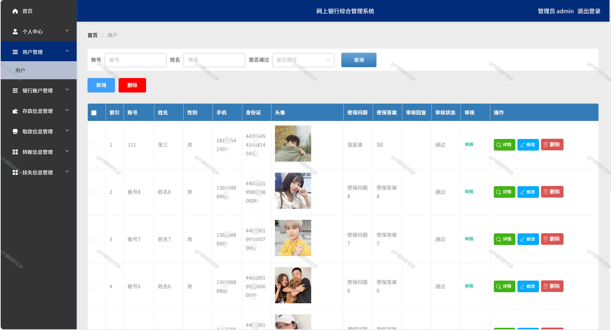
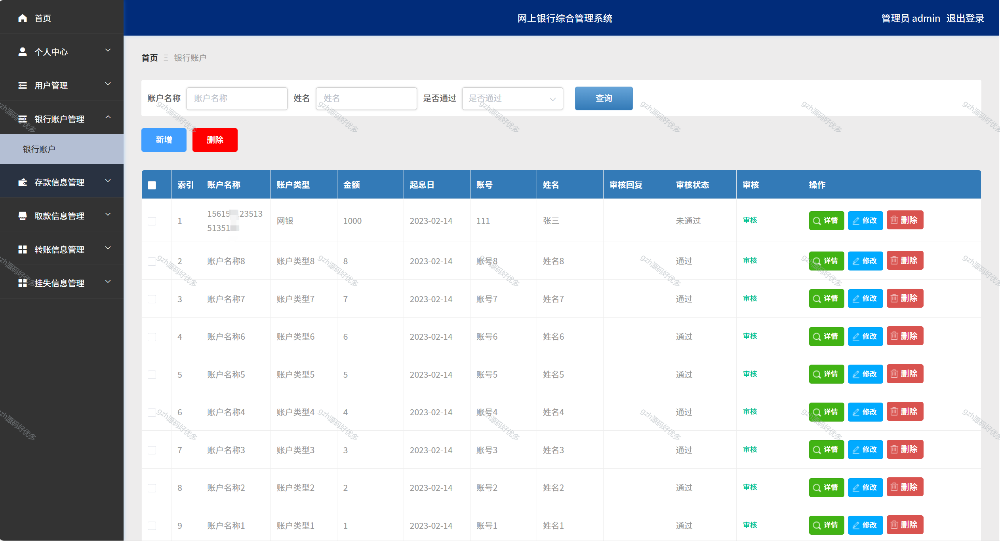
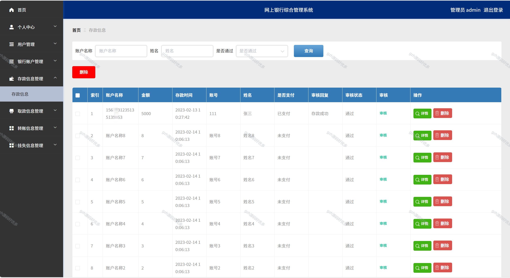
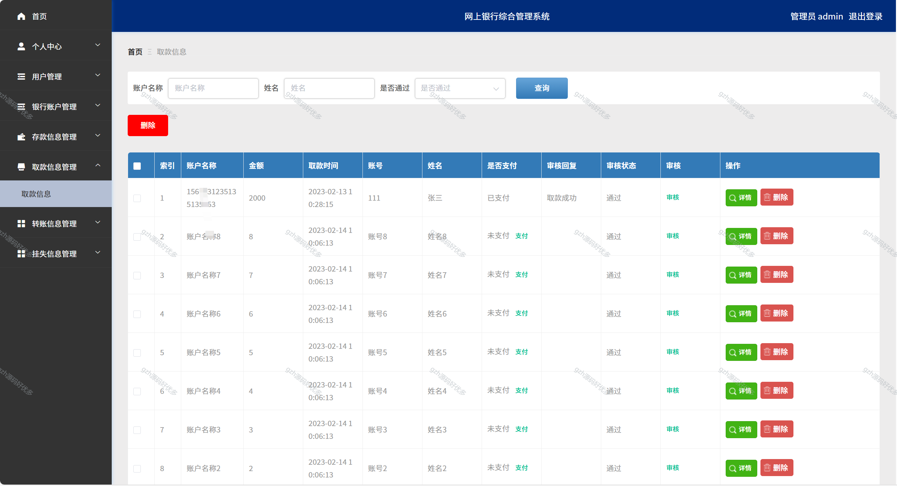
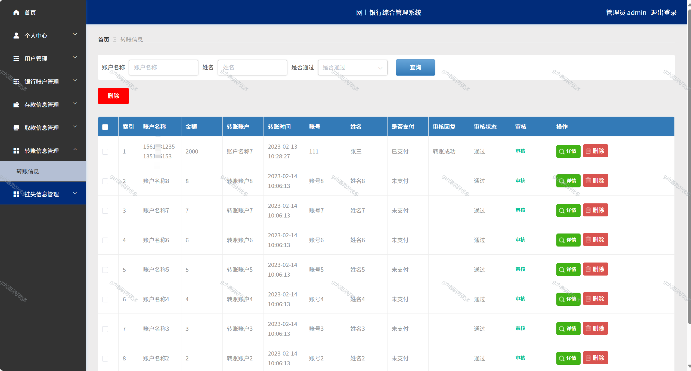
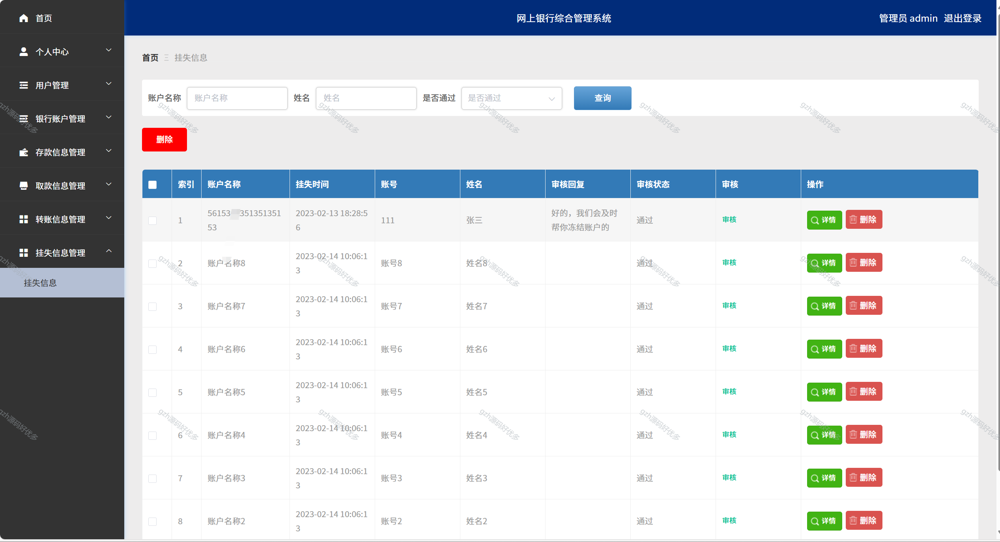
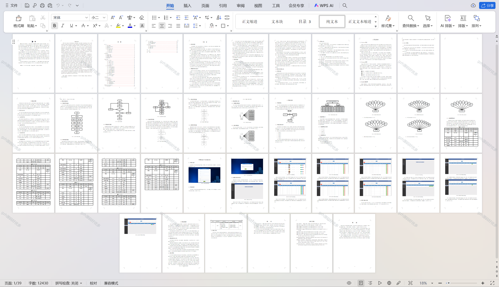

# python103
python103基于Python+Django的网上银行综合管理系统+LW+PPT
 
## 查看主页获取源码

### 一、关键词
网银综合管理平台，网银整体运营管理系统，网络银行综合运维系统

### 二、作品包含
源码+数据库+设计文档万字+PPT+全套环境和工具资源+本地部署教程

### 三、项目技术
前端技术：Vue2.0、Element-ui
后端技术：Python3.7、Django2.0

### 四、运行环境（以下版本亲测，其他版本兼容性请自行测试）
开发工具：PyCharm + VSCODE

数据库：MySQL5.7（最低要5.7版本）

数据库管理工具：Navicat10+

Python：Python3.7

前端Nodejs：14

浏览器：谷歌浏览器

### 五、项目介绍
项目编号：python0103

网上银行综合管理系统主要用于集中管理网上银行的用户信息、交易数据和业务权限，同时保障交易安全、监控风险并支持各类线上金融业务的顺畅运行。
网上银行综合管理系统，管理员可进行用户管理（增删改查、审核等），还能管理银行账户、存款、取款、转账、挂失等信息，实现对各类业务数据的操作与把控 。

### 六、运行截图

